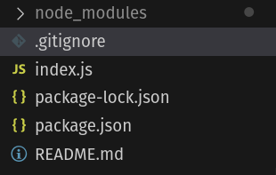
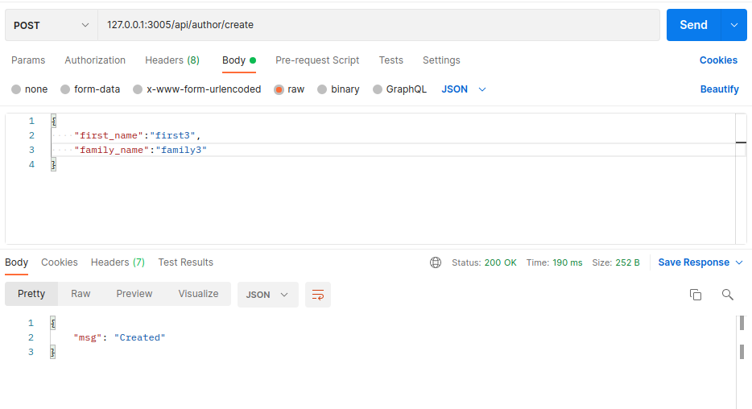
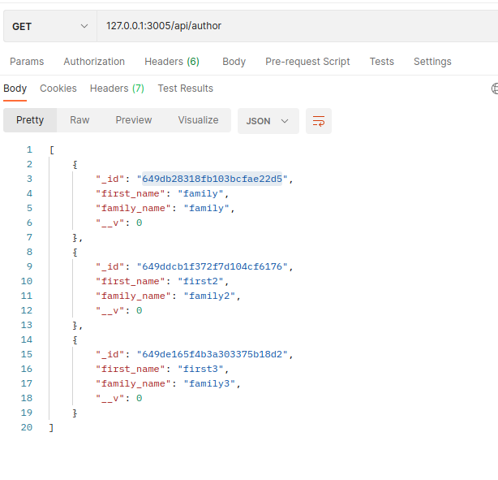
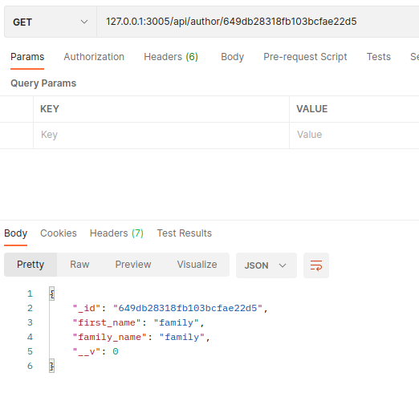
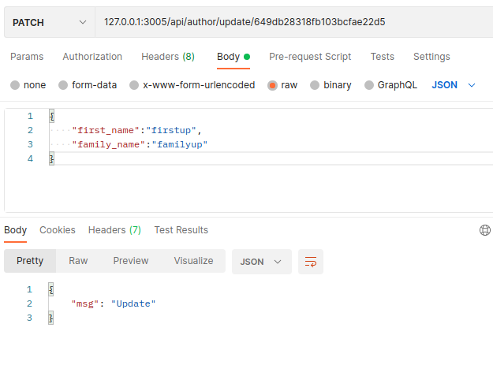
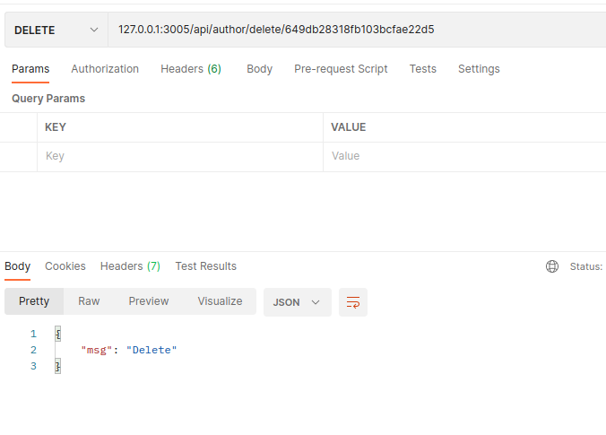

# Introducción a Express.js


## Objetivo

Vamos a desarrollar una API conectada a MongoDB. El propósito de este repositorio es centralizar la documentación necesaria para construir una API utilizando Express, ya que a su formador no le agrada completamente la que está disponible en línea. Este tutorial incluirá enlaces a secciones específicas de la documentación existente, así como información adicional propia. Además, se planea proporcionar un video de apoyo para facilitar el proceso.

## primeros pasos
Recuerda debes tener instalado [Node.js](https://nodejs.org/en/download), despues crea y entra a la carpeta donde vas a guardar el proyecto. 
```
mkdir app
cd app
```
Una vez dentro de la carpeta usa el siguiente comando para crear un archivo que contendra la informacion de configuracion del proyecto (recuerda personalizarla). Deja el punto de entrada como index.js
```
npm init
```

Vamos a instalar express.js

```
npm install express
```
les debe aparecer un archivo package-lock.json y una carpeta node_modules, en este momento es buena idea crear el .gitignore para que no se suba esta ultima.
```
touch .gitignore
```
dentro poner
```
node_modules
```
Ahora vamos a crear un archivo llamado index.js
```
touch index.js
```
Vamos  a instalar nodemon para que nos recarge el servidor siempre que realicemos cambios 
```
npm install nodemon --develop
```

al final de esta seccion deben tener algo parecido a esto: 




## Hola Mundo

Dentro de index.js vamos a poner el siguiente codigo:
```
const express = require('express')

const app = express()
const port = (process.env.PORT || 3005)
app.set('port', port)

app.get('/', (req, res) => {
  res.send('Hello World!')
})

app.listen(port, () => {
  console.log(`Example app listening on port ${port}`)
})
```

Para levantar el servidor vamos a correr el siguiente comando en una consola al nivel del index.js
```
node index.js
```
Como es usual si van al navegador a la direccion 127.0.0.1:3005 van a encontrar el hola mundo.


## Documentación de MongoDB

Van a crear la cuenta, esta es la documentación recomendada para MongoDB, aunque pueden encontrar más en línea.

* [Quick Start](https://www.mongodb.com/docs/drivers/node/current/quick-start/#quick-start) 
* [Download and Install](https://www.mongodb.com/docs/drivers/node/current/quick-start/download-and-install/)

* [Create a MongoDB Deployment](https://www.mongodb.com/docs/drivers/node/current/quick-start/create-a-deployment/)

* [Create a Connection String](https://www.mongodb.com/docs/drivers/node/current/quick-start/create-a-connection-string/#create-a-connection-string)
* [Connect to MongoDB](https://www.mongodb.com/docs/drivers/node/current/quick-start/connect-to-mongodb/)

* [Express Tutorial Part 3: Using a Database (with Mongoose)](https://developer.mozilla.org/en-US/docs/Learn/Server-side/Express_Nodejs/mongoose#setting_up_the_mongodb_database)

## Variables de entorno

Las variables de entorno son valores que se configuran en el sistema operativo y que pueden ser accedidos por las aplicaciones en tiempo de ejecución. En Node.js, puedes acceder a estas variables a través del objeto 'dotenv'.

1. Instala dotenv ejecutando el siguiente comando en tu línea de comandos:
```
npm install dotenv
```
2. Crea un archivo .env en el directorio raíz de tu proyecto.

3. Dentro de .env, define tus variables de entorno por ejemplo:

```
MONGO_DB_URI = `12lkjefoaih1209`
```
4. En el archivo en el que se vayan a utilizar las variables de entorno, se recomienda llamarlas de la siguiente manera:
```
require('dotenv').config();
```
Recuerda que el archivo .env no debe incluirse en tu repositorio de código, especialmente si contiene información sensible como claves de API o contraseñas. Asegúrate de agregarlo a tu archivo .gitignore para evitar que se publique accidentalmente.


## Modelos ORM y MongoDB
Ahora que ya tenemos una cuenta y el link de conexion a la base de datos vamos a empezar con los modelos.


Primero vamos a instalar en ORM, en este caso usaremos mongoose.
```
npm install mongoose
```
Ahora vamos a crear la configuración dentro de index.js. La cual sera el siguiente codigo 
```
const mongoose = require('mongoose')
require('dotenv').config()

mongoose.connect(process.env.MONGO_DB_URI)
.then(()=> console.log('conect to DB'))
.catch((err)=>console.error(err.message))
```
Existen mejores formas de hacer la conexion con la base de datos, pero por ahora esta nos va a servir.


 Como ya es usual crea una carpeta llamada models
```
mkdir models
```
Dentro de la carpeta models vamos a crear un archivo llamado author.js.js
```
touch models/author.js
```
y dentro de author.js.js vamos a poner el siguiente codigo.

```
const mongoose = require('mongoose')

const Schema = mongoose.Schema
const AuthorSchema = new Schema ({
    first_name: {
        type:String,
        require: true,
        maxLength:100
    },
    family_name:{
        type:String,
        require: true,
        maxLength:100
    }
})

module.exports = mongoose.model('Author', AuthorSchema)
```
Vamos a hacer lo mismo con los modelos de Book model, BookInstance model y Genre model.


Usa como guia la [documentacion de mozzila de express.js](https://developer.mozilla.org/en-US/docs/Learn/Server-side/Express_Nodejs/mongoose#defining_the_locallibrary_schema)

### Documentación para los models
* [Express Tutorial Part 3: Using a Database (Defining and creating models)](https://developer.mozilla.org/en-US/docs/Learn/Server-side/Express_Nodejs/mongoose#defining_and_creating_models)

* [Mongoose Schemas (Defining your schema)](https://mongoosejs.com/docs/guide.html#definition)

## Crear autor. 
Como es habitual en nuestra forma de trabajo, vamos a crear el controlador para la [creación](https://mongoosejs.com/docs/api/model.html#Model.create()) de un autor.

```
mkdir controllers
touch controllers/author.js
```
```
const Author = require('../models/author')

const controllerAuthor = {
    create: async (req,res) =>{
        try{
            const first_name = req.body.first_name
            const family_name = req.body.family_name
            await Author.create({
                first_name:first_name, 
                family_name:family_name
            })
            res.json({msg:'Created'})
        } catch(err){
            return res.status(500).json({msg:err.message})
        }
    }
}

module.exports = controllerAuthor
```
Vamos a probar la función desde el archivo index.js, por lo tanto, agregaremos el siguiente código a las importaciones.

```
const controllerAuthor = require('./controllers/author')

```
Después de la ruta del 'Hola Mundo', puedes agregar el siguiente código en el archivo index.js:
```
router.post('/api/author/create',controllerAuthor.create)
```

Y en [postman](https://www.postman.com/) probamos el endpoint como se muestra en la siguiente imagen 



Ahora que ya tenemos el controlador funcionando vamos a hacer la ruta.
```
mkdir routes
touch routes/author.js
```
```
const express =require('express')

const controllerAuthor =require('../controllers/author')
const router = express.Router()

router.post('/create',controllerAuthor.create)

module.exports = router
```
Y en el archivo index.js, eliminamos lo que agregamos para la prueba anterior y colocamos el siguiente código:
```
const authorRoutes = require('./routes/author')

app.use(express.json())
app.use('/api/author',authorRoutes)
```
y el resultado final debe ser este 
```
const express = require('express')
const mongoose = require('mongoose')

const authorRoutes = require('./routes/author')
require('dotenv').config()

const app = express()
const port = (process.env.PORT || 3005)
app.set('port', port)

app.use(express.json())
app.use('/api/author',authorRoutes)

app.get('/', (req, res) => {
  res.send('Hello World!')
})

mongoose.connect(process.env.MONGO_DB_URI)
.then(()=> console.log('conect to DB'))
.catch((err)=>console.error(err.message))

app.listen(port, () => {
  console.log(`Example app listening on port ${port}`)
})
```
Volvemos a usar postman y el resultado debe ser el mismo:


Ahora que ya tenemos ese endpoint, completamos el CRUD. El archivo controllers/author.js podría tener una estructura similar a esta:

```
const Author = require('../models/author')

const controllerAuthor = {
    create: async (req,res) =>{
        try{
            const first_name = req.body.first_name
            const family_name = req.body.family_name
            await Author.create({
                first_name:first_name, 
                family_name:family_name
            })
            res.json({msg:'Created'})
        } catch(err){
            return res.status(500).json({msg:err.message})
        }
    },
    getAuthors: async (req,res) =>{
        try{
            const authors = await Author.find({})
            res.json(authors)
        }catch(err){
            return res.status(500).json({msg:err.message})
        }
    },
    getAuthorForId: async (req,res) =>{
        try{
            const {id} = req.params
            const author = await Author.findById(id)
            res.json(author)
        }catch(err){
            return res.status(500).json({msg:err.message})
        }
    },
    updateAuthor: async (req,res) =>{
        try{
            const {id} = req.params
            const first_name = req.body.first_name
            const family_name = req.body.family_name
            await Author.findByIdAndUpdate(id,{
                first_name:first_name, 
                family_name:family_name
            })
            res.json({msg:'Update'})
        }catch(err){
            console.error(err)
            return res.status(500).json({msg:err.message})            
        }
    },
    deleteAuthor:async (req,res)=>{
        try {
            const {id} = req.params
            await Author.findByIdAndDelete(id)
            res.json({msg:'Delete'})     
        } catch (err) {
            console.error(err)
            return res.status(500).json({msg:err.message})
        }
    }

}

module.exports = controllerAuthor
```
Mientas que las rutas deben quedar algo asi router/author.js:
```
const express =require('express')

const controllerAuthor =require('../controllers/author')

const router = express.Router()


router.get('/',controllerAuthor.getAuthors)
router.get('/:id',controllerAuthor.getAuthorForId)
router.post('/create',controllerAuthor.create)
router.patch('/update/:id',controllerAuthor.updateAuthor)
router.delete('/delete/:id',controllerAuthor.deleteAuthor)

module.exports = router
```

Finalmente probamos los endpoints:
#### Postman Get Authors



#### Get AutorFor Id



#### Update Author



#### Delete Author



### Documentación para los controllers

* [Controller](https://developer.mozilla.org/en-US/docs/Learn/Server-side/Express_Nodejs/Displaying_data/Book_list_page#controller) Solo mirar la parte del controlador
### Algunas query de uso común 
* [Model.find()](https://mongoosejs.com/docs/api/model.html#Model.find())
* [Model.findById()](https://mongoosejs.com/docs/api/model.html#Model.findById())
* [Model.findByIdAndRemove()](https://mongoosejs.com/docs/api/model.html#Model.findByIdAndRemove())
* [Model.findByIdAndUpdate()](https://mongoosejs.com/docs/api/model.html#Model.findByIdAndUpdate())
* [Model.create()](https://mongoosejs.com/docs/api/model.html#Model.create())
* [Model.deleteOne()](https://mongoosejs.com/docs/api/model.html#Model.deleteOne())

### Documentación para los routers

* [Documentación Expressjs Router](https://expressjs.com/en/api.html#router)
* [Documentacion Mozilla.org ](https://developer.mozilla.org/en-US/docs/Learn/Server-side/Express_Nodejs/routes#routes_primer) Recuerda al momento de llamar el [controlador](https://developer.mozilla.org/en-US/docs/Learn/Server-side/Express_Nodejs/routes#author_controller) usar lo que esta en la sección de los controladores, es decir las query a la Base de datos que estan en la seccion anterior.

## Contacto

Si tienes alguna pregunta, sugerencia o deseas obtener el workbook para desarrollar este proyecto, no dudes en contactarme a través de: [jsanchez@educamas.com.co](jsanchez@educamas.com.co).

# node-basic-c9
